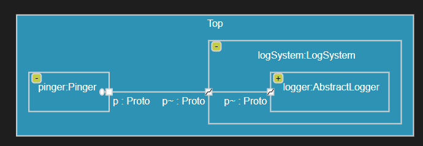

An object in an application has several "dependencies", i.e. various things that affect how it behaves at run-time. For a capsule part that gets incarnated with capsule instances at run-time, examples of such dependencies include which capsule to create an instance of, what data to pass to the capsule constructor, and which thread that should run the created capsule instance. But the behavior of a capsule instance also depends a lot on which other capsule instances it communicates with at run-time, so those are also examples of dependencies.

**Dependency injection** is a technique where run-time dependencies of objects are managed by a central **injector** object, instead of being hardcoded across the application. The injector is configured so it provides the desired dependencies for objects when they are needed at run-time. One benefit with using dependency injection is that objects in your application become more loosly coupled and it becomes much easier to configure and customize the behavior of your application.

There are many dependency injection frameworks for C++ which you can use for the passive C++ classes of your application. To use dependency injection for capsules, the TargetRTS provides a class [`RTInjector`](../targetrts-api/class_r_t_injector.html). You can use this class for registering create-functions for capsule parts at application start-up. When the TargetRTS needs to incarnate a capsule part, it will check if a create-function is registered for it. If so, that create-function will be called for creating the capsule instance. Otherwise, the capsule instance will be created by the TargetRTS itself, as usual.

To use dependency injection in your realtime application you need to implement a [global capsule factory](capsule-factory.md#global-capsule-factory) and specify it in your TC. The `create()` function of the global capsule factory delegates all calls to the [`RTInjector`](../targetrts-api/class_r_t_injector.html) singleton object.

You also must configure the injector by registering create-functions for all capsule parts where you want to customize how a capsule instance should be created. You need to do this early, typically at application start-up. At least it must be done before the TargetRTS attempts to create a capsule instance in a capsule part which you want to customize with dependency injection. A good place can be to do it in the constructor of the top capsule, in the main function of your application, or in the constructor of a static object (such as the global capsule factory object itself).

A create-function is registered by calling `registerCreateFunction()` on [`RTInjector`](../targetrts-api/class_r_t_injector.html). The second argument is the create-function, and the first argument is a string that specifies the path to the capsule part in the composite structure of the application. Such paths always start with a `/` denoting the top capsule, and then follows names of capsules parts separated by `/`. You can use a `:` to specify the index of a capsule instance in a part with multiplicity. For example, if the application has this composite structure



then the path string `/logSystem:0/logger` refers to the capsule part `logger` that is contained in the `LogSystem` capsule instance which is the first (index 0) capsule instance in the capsule part `logSystem` of the top capsule `Top`.

A call to `registerCreateFunction()` to customize the incarnation of capsule instances in the `logger` capsule part could then look like this:

``` cpp
RTInjector::getInstance().registerCreateFunction("/logSystem:0/logger",
	[this](RTController * c, RTActorRef * a, int index) {						
		return new TimestampLogger_Actor(c, a);
	}
);
```

!!! example
    You can find a sample application that uses dependency injection [here](https://github.com/secure-dev-ops/code-realtime/tree/main/art-comp-test/tests/dependency_injection_static).

In most cases your application will only register create-functions once at start-up. However, [`RTInjector`](../targetrts-api/class_r_t_injector.html) allows to do it at any time, and you can also remove or replace an already registered create-function. This makes it possible to implement very dynamic dependency injection scenarios. For example, you can change which capsule that gets instantiated depending on how much memory is currently available.

Dependency injection can for example be useful when implementing capsule unit testing in order to "mock out" capsules which the capsule-under-test depends on. In this case you could for example let the registration of create-functions be controlled by a configuration file that is part of the test case.

Another possibility is to combine dependency injection with [Build Variants](../building/build-variants.md) to build multiple variants of an application by means of high-level build settings (so called "build variants"). The build variant script can set compilation macros that control how injected create-functions behave.
